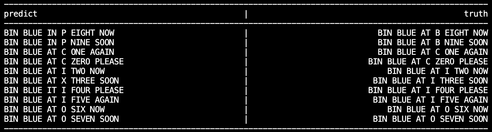

# LipCoordFormer: A Transformer-Based Lip-Reading Model with Visual-Landmark-Temporal Fusion
Lip-reading translation refers to converting visual lip movements into human-understandable natural sentences. Current state-of-the-art lip-reading approaches are based on frame-level spatiotemporal convolutions and recurrent networks, which struggle with visual noise from non-lip regions, inadequate modeling of long-range temporal d pendencies, and lacks visual-geometric alignments. To address these limitations, we propose LipCoordFormer, a transformer-based architecture integrating spatiotemporal image encoder and lip movement landmarks to enable joint learning of visual-geometric patterns while eliminating frame-level alignment dependencies. Our model achieves a character error rate (CER) of 2.78% and word error rate (WER) of 7.39% on the GRID corpus, which is comparable    to the state-of-the-art models trained on the same dataset. (LipNet: CER: 2.0%, WER: 4.8%; LCANet: CER: 1.3%, WER: 2.9%; STFM: WER: 1.3%) while introducing criti- cal advancements in noise robustness and temporal depen- dency modeling. This result is achieved using only 1/4 training data of the current approaches and further reduce train- ing time to 12 hours

# Results

Some testing results

# Dataset
We used GRID dataset, which can be downloaded from here: http://spandh.dcs.shef.ac.uk/gridcorpus/
Here is a sample video,

